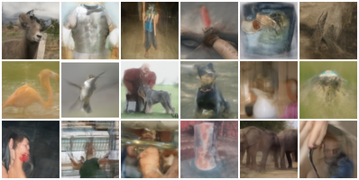

# Multistep Consistency Distillation in the EDM Framework *(Unofficial)*

An open-source, unofficial implementation of [Multistep Consistency Models](https://arxiv.org/abs/2403.06807) (Heek et al., 2024) re-formulated in the [EDM](https://arxiv.org/abs/2206.00364) framework (Karras et al., 2022). The original paper uses a VP / DDIM formulation; this repo adapts it to EDM's Karras noise schedule and Heun 2nd-order teacher, adding several training improvements. Forked from [NVIDIA's EDM repo](https://github.com/NVlabs/edm).

## Why this matters: the discretization error problem

Running the EDM teacher at only 8 NFEs with the Heun sampler produces severe discretization errors — the image quality collapses to an FID of ~25. The student trained with consistency distillation recovers full quality at the same 8 NFEs, matching the teacher's 511-step FID of 2.3.

| Sampler | NFEs | FID (ImageNet-64, class-cond.) |
|---------|------|-------------------------------|
| Teacher (EDM Heun, deterministic, no churn) | 8 | ~25 *(discretization error)* |
| Teacher (EDM Heun, deterministic, no churn) | 511 | 2.3 |
| **Student — this repo (S=8, consistency distilled)** | **8** | **2.3** |

<table>
<tr>
<td align="center"><b>Teacher @ 8 steps</b><br><sub>FID ≈ 25 — severe discretization error</sub><br></td>
<td align="center"><b>Student @ 8 steps (ours)</b><br><sub>FID = 2.3 — matches the 511-step teacher</sub><br></td>
</tr>
</table>

The 8-step student was trained for **157 Mimg** on 32 GPUs (8 nodes × 4 H100s).

**[Download pretrained student checkpoint (network-snapshot-157698.pkl)](https://drive.google.com/file/d/1KCufldmXzjWPkyQvPiykxpadLTbqg99N/view?usp=share_link)**

## Features

- **EDM-native consistency distillation** — teacher uses a Heun 2nd-order sampler with the Karras noise schedule (ρ=7), matching the EDM inference regime exactly
- **Sigma-anchored segmentation** — consistency intervals are defined by σ-boundaries rather than step indices, with automatic deduplication of near-identical σ values across resolutions
- **Synchronized dropout** — dropout masks are synchronized across the student and the teacher-hop target so the training signal is not corrupted by mask mismatch between the two forward passes
- **Terminal anchor** — forces the student's prediction at the terminal noise level (σ_max) to match the teacher exactly, stabilizing early training
- **Terminal teacher hop** — uses a teacher hop at the boundary step rather than a student self-consistency target, improving high-noise accuracy
- **Teacher step annealing** — smooth ramp of the number of teacher steps from `T_start` to `T_end` over a configurable number of kimg, giving the student time to warm up before facing harder targets
- **Power-function EMA (phEMA)** — maintains multiple EMA checkpoints with different smoothing strengths (e.g. std=0.05 and std=0.10) simultaneously; the lower-std EMA trades recency for smoothness and often gives the best FID at evaluation time. The phEMA implementation is taken directly from [EDM2](https://arxiv.org/abs/2312.02696) (Karras et al., 2024) \[[code](https://github.com/NVlabs/edm2)\]
- **Built-in FID validation** — periodic FID evaluation runs directly inside the training loop on a configurable schedule; no separate evaluation script needed
- **W&B integration** — loss curves, FID, gradient norms, EMA diagnostics, CD edge statistics, and step-level metrics
- **Mixed precision** — FP16/FP32 for student forward/backward; FP64 for numerically sensitive operations (invDDIM, Heun hops)
- **Multi-node DDP** — standard PyTorch distributed with barrier-guarded checkpoint saves and automatic rotation (last 2 states + best-FID state retained)

## Prerequisites

```bash
conda env create -f environment.yml
conda activate edm
```

Requires PyTorch 2.0+, CUDA 11.8+.

Download the pretrained EDM teacher checkpoint:

```bash
# Class-conditional ImageNet-64 ADM teacher
wget https://nvlabs-fi-cdn.nvidia.com/edm/pretrained/edm-imagenet-64x64-cond-adm.pkl
```

Download the ImageNet-64 dataset and pre-compute FID reference statistics (see [EDM repo](https://github.com/NVlabs/edm) for dataset preparation instructions).

## Generation with the Pretrained Student

Download the checkpoint linked above, then:

```bash
torchrun --standalone --nproc_per_node=4 generate.py \
  --network=network-snapshot-157698.pkl \
  --outdir=samples --seeds=0-49999 --batch=128 --steps=8
```

Evaluate FID:

```bash
python fid.py calc --images=samples --ref=fid-refs/imagenet-64x64.npz
```

## Training

### Exact command used for the pretrained checkpoint

This is the exact command run on 8 nodes × 4 H100s (32 GPUs total) to produce the released checkpoint:

```bash
# In your sbatch script:
head_node_ip=$(scontrol show hostnames "$SLURM_JOB_NODELIST" | head -n 1)
MASTER_PORT=29500

srun --ntasks="$SLURM_NNODES" --ntasks-per-node=1 --kill-on-bad-exit=1 \
  torchrun \
    --nnodes="$SLURM_NNODES" \
    --nproc_per_node=4 \
    --node_rank="$SLURM_NODEID" \
    --rdzv_backend=c10d \
    --rdzv_endpoint="${head_node_ip}:${MASTER_PORT}" \
    --rdzv_id="$SLURM_JOB_ID" \
  train.py \
    --outdir=training-runs/imagenet64-cd-s8 \
    --data=/path/to/imagenet-64x64.zip \
    --cond=1 --arch=adm --precond=edm \
    --batch=2048 --batch-gpu=64 --fp16=True \
    --ema=50 --ema_rampup=0.05 --lr=8e-5 \
    --phema=0.05,0.10 --phema_snap=60 \
    --consistency=True \
    --sampling_mode=edm \
    --dropout=0.20 \
    --dout_resolutions=16,8 \
    --duration=210 \
    --terminal_anchor --terminal_teacher_hop \
    --teacher=/path/to/edm-imagenet-64x64-cond-adm.pkl \
    --S=8 --T_start=64 --T_end=1280 --T_anneal_kimg=104800 \
    --rho=7 --sigma_min=0.002 --sigma_max=80 \
    --cd_loss=pseudo_huber --cd_weight_mode=sqrt_karras \
    --val=1 \
    --val_ref=/path/to/fid-refs/imagenet-64x64.npz \
    --val_steps=8 --val_every=20 --val_at_start=0 \
    --val_teacher=False \
    --snap=20 --dump=20 \
    --workers=4 \
    --seed=1959836853
```

### Key Training Options

**Data and model:**

| Option | Description |
|--------|-------------|
| `--data` | Path to dataset zip (ImageNet-64 in this case) |
| `--cond=1` | Class-conditional training |
| `--arch=adm` | ADM (DhariwalUNet) architecture matching the teacher |
| `--precond=edm` | EDM preconditioning (σ-scaled inputs/outputs) |
| `--batch=2048` | Global batch size across all GPUs |
| `--batch-gpu=64` | Per-GPU microbatch; gradient accumulation is used if `batch / (gpus × batch-gpu) > 1` |
| `--fp16=True` | Mixed-precision training |

**Optimizer and EMA:**

| Option | Description |
|--------|-------------|
| `--lr=8e-5` | Adam learning rate |
| `--ema=50` | EMA half-life in kimg for the standard evaluation EMA |
| `--ema_rampup=0.05` | EMA rampup ratio — effective half-life is `min(ema, rampup × cur_nimg)` during early training, preventing the EMA from being dominated by initial random weights |
| `--phema=0.05,0.10` | Power-function EMA standard deviations; produces separate checkpoint files (e.g. `-0.050.pkl`, `-0.100.pkl`). phEMA code from [EDM2](https://arxiv.org/abs/2312.02696) |
| `--phema_snap=60` | Save phEMA checkpoints every 60 ticks |

**Consistency distillation:**

| Option | Description |
|--------|-------------|
| `--consistency=True` | Enable CD training mode |
| `--teacher` | Path to frozen EDM teacher checkpoint (`.pkl`) |
| `--S=8` | Number of student inference steps (segments) |
| `--T_start=64` | Number of teacher Heun steps at the start of training |
| `--T_end=1280` | Number of teacher Heun steps at the end of annealing |
| `--T_anneal_kimg=104800` | How many kimg to ramp from T_start to T_end (~half the total run) |
| `--rho=7` | Karras schedule exponent (matches EDM paper) |
| `--sigma_min=0.002` | Minimum noise level |
| `--sigma_max=80` | Maximum noise level |
| `--sampling_mode=edm` | Use EDM Karras schedule for the σ-grid (as opposed to VP cosine) |
| `--cd_loss=pseudo_huber` | Loss function — pseudo-Huber is more robust to outliers than L2 |
| `--cd_weight_mode=sqrt_karras` | Per-edge loss weighting proportional to `sqrt(σ_t - σ_s)` (Karras-inspired) |
| `--terminal_anchor` | Pin the student's output at σ_max to the teacher's, stabilizing high-noise training |
| `--terminal_teacher_hop` | Use a teacher hop (not student self-consistency) at the last boundary step |
| `--dropout=0.20` | Dropout rate; masks are **synchronized** between the main student forward pass and the teacher-hop target computation |
| `--dout_resolutions=16,8` | Only apply dropout at the 16×16 and 8×8 resolution stages of the UNet, following Hoogeboom et al. \[4\] who find that restricting dropout to lower resolutions improves sample quality |

**Schedule and checkpointing:**

| Option | Description |
|--------|-------------|
| `--duration=210` | Total training duration in Mimg (210 million images seen, ~102k optimizer steps at batch 2048) |
| `--snap=20` | Save network snapshot (`.pkl`) every 20 ticks |
| `--dump=20` | Save full training state (`.pt`) every 20 ticks for resuming; the training loop automatically retains only the 2 most recent state files plus the one at the best validation FID |

**Built-in validation:**

| Option | Description |
|--------|-------------|
| `--val=1` | Enable periodic FID validation |
| `--val_ref` | Path to pre-computed reference Inception statistics (`.npz`) |
| `--val_every=20` | Run validation every 20 ticks |
| `--val_steps=8` | Number of student steps to use during validation generation |
| `--val_teacher=False` | Skip one-time teacher FID validation at startup |
| `--val_at_start=0` | Do not run validation before the first training tick |

Validation runs entirely within the training process — no separate jobs needed. FID results are written to `metrics-val.jsonl` in the run directory and logged to W&B.

### Resuming a Run

```bash
train.py ... --resume=training-runs/imagenet64-cd-s8/00000-.../training-state-XXXXXX.pt
```

## Key Files

- `train.py` — main training script with all CD flags
- `training/loss_cd.py` — consistency distillation loss, edge sampling, pseudo-Huber weighting
- `training/consistency_ops.py` — invDDIM, Heun hops, sigma-grid utilities
- `training/training_loop.py` — training loop with phEMA, built-in validation, checkpoint rotation
- `validation.py` — FID evaluation called from within the training loop
- `generate.py` — multi-GPU image generation from a saved `.pkl`
- `fid.py` — FID computation against reference statistics

## References

1. Heek, J., Hoogeboom, E., & Salimans, T. (2024). *Multistep Consistency Models*. arXiv:2403.06807
2. Karras, T., Aittala, M., Aila, T., & Laine, S. (2022). *Elucidating the Design Space of Diffusion-Based Generative Models*. NeurIPS 2022. arXiv:2206.00364
3. Karras, T., Aittala, M., Lehtinen, J., Hellsten, J., Aila, T., & Laine, S. (2024). *Analyzing and Improving the Training Dynamics of Diffusion Models (EDM2)*. CVPR 2024. arXiv:2312.02696 — **phEMA implementation taken from this work.**
4. Hoogeboom, E., Heek, J., & Salimans, T. (2023). *Simple Diffusion: End-to-End Diffusion for High-Resolution Images*. ICML 2023. arXiv:2301.11093 — **basis for restricting dropout to lower UNet resolutions (`--dout_resolutions`).**

## License

Inherits the original EDM license. See `LICENSE.txt`.
